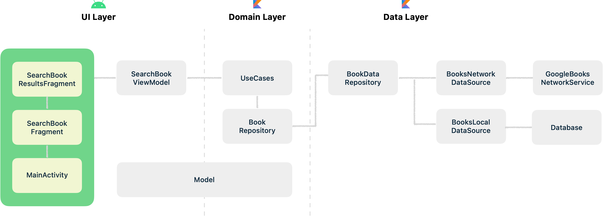

# README.md

### Architecture



---

### Tech Stack

- Kotlin
- Coroutines
- Hilt
- Retrofit
- Room
- Splash screens
- ViewBinding
- ViewModel
- Lifecycle
- Glide
- Timber

---

### Feature

**검색**

`SearchBookFragment.kt`

```kotlin
// 검색 버튼을 눌렀을 때
searchQueryEditText.setOnEditorActionListener { editText, actionId, _ ->
    if (actionId == EditorInfo.IME_ACTION_SEARCH) {
        val query = editText.text.toString()

        if (query.isNotBlank()) {
            viewModel.search(query)
            ..
        }
    }
    ..
}
```

`SearchBookViewModel.kt`

```kotlin
sealed class LoadParams {
    data class Refresh(val query: String): LoadParams()
    data class Append(val query: String, val index: Int): LoadParams()
}

fun search(query: String) {
    viewModelScope.launch {
        refresh.emit(LoadParams.Refresh(query))
        ..
    }
}

val _searchResults: StateFlow<BookSearchResults?> = refresh.filterNotNull()
    .combine(append) { refresh, append ->
        // 검색
        if (refresh.query != append?.query) {
            _loading.emit(Unit)
            SearchBookParams(refresh.query)
        } else {
            SearchBookParams(append.query, append.index)
        }
    }
    .mapLatest { searchBookUseCase(it) }
    .map { result ->
        // 에러 전파
        if (result is Result.Error) {
            _error.emit(result.exception)
        }
        result.successOr(null)
    }
    .filterNotNull()
    .runningReduce { accumulator, refreshOrAppend ->
        if (accumulator.query == refreshOrAppend.query) {
            // 페이지네이션
            if (refreshOrAppend.totalCount != 0) {
                accumulator.copy(data = (accumulator.data + refreshOrAppend.data).distinctBy { it.id })
            } else {
                accumulator
            }
        } else {
            // PATH 새로운 검색어로 검색한 결과
            refreshOrAppend
        }
    }
    .flowOn(Dispatchers.Default)
    .stateIn(viewModelScope, SharingStarted.Eagerly, null)

val searchResults: Flow<BookSearchResults> = _searchResults.filterNotNull()
```

`SearchBookResultsFragment.kt`

```kotlin
viewLifecycleOwner.lifecycleScope.launch {
    viewLifecycleOwner.lifecycle.repeatOnLifecycle(Lifecycle.State.STARTED) {
        launch {
            viewModel.searchResults.collect { results ->
                binding.apply {
                    searchResultsTotalCountTextView.text = requireContext().getString(
                        R.string.search_results_total_count,
                        results.totalCount
                    )

                    adapter.submitList(results.data) {
                        loadingView.root.isVisible = false
                    }

                    noSearchResultView.root.isVisible = results.data.isEmpty()
                }
            }
	    }
    }
}
```

**페이지네이션**

```kotlin
searchResultsRecyclerView.addOnScrollListener(object: RecyclerView.OnScrollListener() {
    override fun onScrolled(recyclerView: RecyclerView, dx: Int, dy: Int) {
        super.onScrolled(recyclerView, dx, dy)

        val lastCompletelyVisibleItemPosition = (recyclerView.layoutManager as? LinearLayoutManager)?.findLastCompletelyVisibleItemPosition()

        // 마지막 아이템 -10번째 아이템에서 다음 페이지 로드
        if (lastCompletelyVisibleItemPosition != null && lastCompletelyVisibleItemPosition >= adapter.itemCount - 10) {
            viewModel.load(adapter.itemCount)
        }
    }
})
```

`SearchBookViewModel.kt`

```kotlin
fun load(index: Int) {
    viewModelScope.launch {
        val query= requireNotNull(refresh.value?.query)

        append.emit(LoadParams.Append(query, index))
    }
}

val _searchResults: StateFlow<BookSearchResults?> = refresh.filterNotNull()
    .combine(append) { refresh, append ->
        if (refresh.query != append?.query) {
            _loading.emit(Unit)
            SearchBookParams(refresh.query)
        } else {
            // 다음 페이지 로드
            SearchBookParams(append.query, append.index)
        }
    }
    .mapLatest { searchBookUseCase(it) }
    .map { result ->
        // 에러 전파
        if (result is Result.Error) {
            _error.emit(result.exception)
        }
        result.successOr(null)
    }
    .filterNotNull()
    .runningReduce { accumulator, refreshOrAppend ->
        if (accumulator.query == refreshOrAppend.query) {
            if (refreshOrAppend.totalCount != 0) {
                // PATH #1 이전 검색 결과와 페이징 데이터를 중복없이 합치는 과정
                accumulator.copy(data = (accumulator.data + refreshOrAppend.data).distinctBy { it.id })
            } else {
                // PATH #2 더 이상 불러올 데이터가 없을 때
                accumulator
            }
        } else {
            refreshOrAppend
        }
    }
    .flowOn(Dispatchers.Default)
    .stateIn(viewModelScope, SharingStarted.Eagerly, null)
```
